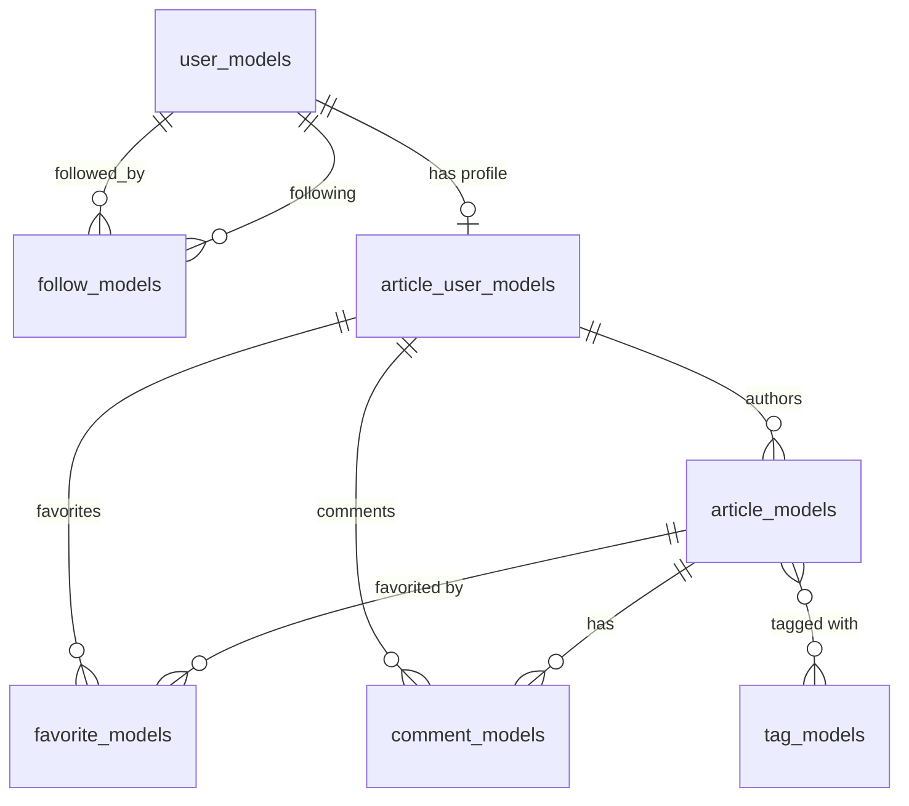

# Database Layer

## Sections
- [Schema](schema.md) - 8 tables (7 + 1 join), 9 indexes
- [Repositories](repositories.md) - Active Record pattern, 35 data access points

## Configuration

**Database:** SQLite
**ORM:** GORM v2 (`gorm.io/gorm`)
**Driver:** `gorm.io/driver/sqlite`

### Connection Configuration

[common/database.go#L49-L69](https://github.com/gothinkster/golang-gin-realworld-example-app/blob/main/common/database.go#L49-L69)

| Setting | Production | Test |
|---------|------------|------|
| Database Path | `DB_PATH` env or `./data/gorm.db` | `TEST_DB_PATH` env or `./data/gorm_test.db` |
| Max Idle Connections | 10 | 3 |
| Logger | Default | Info level |

## Migrations

**Strategy:** Auto-migration via GORM `db.AutoMigrate()`
**Location:** [hello.go#L15-L22](https://github.com/gothinkster/golang-gin-realworld-example-app/blob/main/hello.go#L15-L22)

No versioned migration files. Schema is derived from Go struct definitions with GORM tags.

## Entity Relationships

## Tables

| Table | Columns | Unique Indexes | Purpose |
|-------|---------|----------------|---------|
| user_models | 6 | email | Core user authentication |
| follow_models | 6 | - | User-to-user follow relationships |
| article_user_models | 5 | - | Links users to article authorship |
| article_models | 9 | slug | Article content |
| favorite_models | 6 | - | Article favorites |
| tag_models | 5 | tag | Article tags |
| comment_models | 7 | - | Article comments |
| article_tags | 2 | - | Many-to-many join table |

## Data Access Pattern

This codebase uses **Active Record pattern** rather than Repository pattern:
- Model methods contain data access logic (e.g., `userModel.Update()`)
- Package-level functions for queries (e.g., `FindOneUser()`)
- Global database connection via `common.GetDB()`

See [repositories.md](repositories.md) for full function inventory.

## Summary
- **Tables:** 8 (7 + 1 join table)
- **Indexes:** 9 (3 unique, 6 on deleted_at for soft delete)
- **Data Access Points:** 35
- **JSONB Columns:** None

## Unknowns
- No explicit foreign key constraints defined in GORM tags (relies on convention)
- Soft delete enabled on all models with `gorm.Model` (uses `deleted_at` column)
- No database-level cascade delete configured
