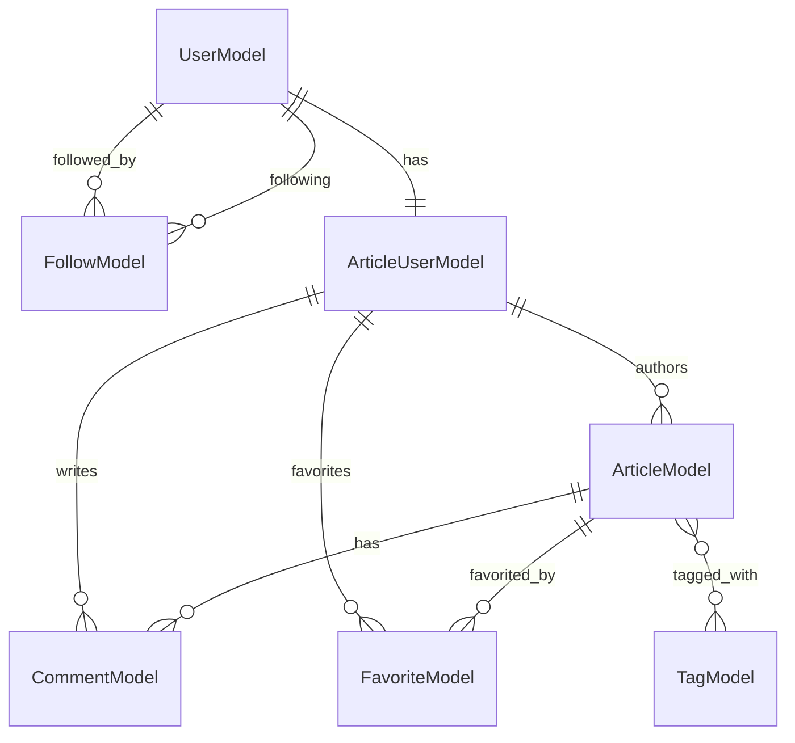

# Entities

## User Aggregate

### UserModel [MUST]

[UserModel](https://github.com/gothinkster/golang-gin-realworld-example-app/blob/main/users/models.go#L16-L23)

```go
type UserModel struct {
	ID           uint    `gorm:"primaryKey"`
	Username     string  `gorm:"column:username"`
	Email        string  `gorm:"column:email;uniqueIndex"`
	Bio          string  `gorm:"column:bio;size:1024"`
	Image        *string `gorm:"column:image"`
	PasswordHash string  `gorm:"column:password;not null"`
}
```

**Table:** `user_models` (GORM convention)

| Field | Column | Type | Constraints |
|-------|--------|------|-------------|
| ID | id | uint | PRIMARY KEY |
| Username | username | string | - |
| Email | email | string | UNIQUE INDEX |
| Bio | bio | string | size:1024 |
| Image | image | *string | nullable |
| PasswordHash | password | string | NOT NULL |

**Methods:**

| Method | Signature | Description | Source |
|--------|-----------|-------------|--------|
| setPassword | `(u *UserModel) setPassword(password string) error` | Hash password using bcrypt | [L57-L66](https://github.com/gothinkster/golang-gin-realworld-example-app/blob/main/users/models.go#L57-L66) |
| checkPassword | `(u *UserModel) checkPassword(password string) error` | Verify password against hash | [L71-L75](https://github.com/gothinkster/golang-gin-realworld-example-app/blob/main/users/models.go#L71-L75) |
| Update | `(model *UserModel) Update(data interface{}) error` | Update user fields | [L99-L103](https://github.com/gothinkster/golang-gin-realworld-example-app/blob/main/users/models.go#L99-L103) |
| following | `(u UserModel) following(v UserModel) error` | Create follow relationship | [L108-L116](https://github.com/gothinkster/golang-gin-realworld-example-app/blob/main/users/models.go#L108-L116) |
| isFollowing | `(u UserModel) isFollowing(v UserModel) bool` | Check if following another user | [L121-L129](https://github.com/gothinkster/golang-gin-realworld-example-app/blob/main/users/models.go#L121-L129) |
| unFollowing | `(u UserModel) unFollowing(v UserModel) error` | Remove follow relationship | [L134-L138](https://github.com/gothinkster/golang-gin-realworld-example-app/blob/main/users/models.go#L134-L138) |
| GetFollowings | `(u UserModel) GetFollowings() []UserModel` | Get list of followed users | [L143-L154](https://github.com/gothinkster/golang-gin-realworld-example-app/blob/main/users/models.go#L143-L154) |

---

### FollowModel [MUST]

[FollowModel](https://github.com/gothinkster/golang-gin-realworld-example-app/blob/main/users/models.go#L36-L42)

```go
type FollowModel struct {
	gorm.Model
	Following    UserModel
	FollowingID  uint
	FollowedBy   UserModel
	FollowedByID uint
}
```

**Table:** `follow_models` (GORM convention)

**Embedded:** `gorm.Model` provides ID, CreatedAt, UpdatedAt, DeletedAt

| Field | Column | Type | Constraints |
|-------|--------|------|-------------|
| ID | id | uint | PRIMARY KEY (from gorm.Model) |
| CreatedAt | created_at | time.Time | (from gorm.Model) |
| UpdatedAt | updated_at | time.Time | (from gorm.Model) |
| DeletedAt | deleted_at | gorm.DeletedAt | soft delete (from gorm.Model) |
| Following | - | UserModel | FK relationship |
| FollowingID | following_id | uint | FK to user_models |
| FollowedBy | - | UserModel | FK relationship |
| FollowedByID | followed_by_id | uint | FK to user_models |

**Relationship:** Many-to-Many self-referential join table for User follows User

---

## Article Aggregate

### ArticleModel [MUST]

[ArticleModel](https://github.com/gothinkster/golang-gin-realworld-example-app/blob/main/articles/models.go#L11-L21)

```go
type ArticleModel struct {
	gorm.Model
	Slug        string `gorm:"uniqueIndex"`
	Title       string
	Description string `gorm:"size:2048"`
	Body        string `gorm:"size:2048"`
	Author      ArticleUserModel
	AuthorID    uint
	Tags        []TagModel     `gorm:"many2many:article_tags;"`
	Comments    []CommentModel `gorm:"ForeignKey:ArticleID"`
}
```

**Table:** `article_models` (GORM convention)

**Embedded:** `gorm.Model` provides ID, CreatedAt, UpdatedAt, DeletedAt

| Field | Column | Type | Constraints |
|-------|--------|------|-------------|
| ID | id | uint | PRIMARY KEY (from gorm.Model) |
| CreatedAt | created_at | time.Time | (from gorm.Model) |
| UpdatedAt | updated_at | time.Time | (from gorm.Model) |
| DeletedAt | deleted_at | gorm.DeletedAt | soft delete (from gorm.Model) |
| Slug | slug | string | UNIQUE INDEX |
| Title | title | string | - |
| Description | description | string | size:2048 |
| Body | body | string | size:2048 |
| Author | - | ArticleUserModel | FK relationship |
| AuthorID | author_id | uint | FK to article_user_models |
| Tags | - | []TagModel | many2many:article_tags |
| Comments | - | []CommentModel | FK:ArticleID |

**Methods:**

| Method | Signature | Description | Source |
|--------|-----------|-------------|--------|
| favoritesCount | `(article ArticleModel) favoritesCount() uint` | Count favorites for article | [L67-L74](https://github.com/gothinkster/golang-gin-realworld-example-app/blob/main/articles/models.go#L67-L74) |
| isFavoriteBy | `(article ArticleModel) isFavoriteBy(user ArticleUserModel) bool` | Check if user favorited article | [L76-L84](https://github.com/gothinkster/golang-gin-realworld-example-app/blob/main/articles/models.go#L76-L84) |
| favoriteBy | `(article ArticleModel) favoriteBy(user ArticleUserModel) error` | Add favorite | [L128-L136](https://github.com/gothinkster/golang-gin-realworld-example-app/blob/main/articles/models.go#L128-L136) |
| unFavoriteBy | `(article ArticleModel) unFavoriteBy(user ArticleUserModel) error` | Remove favorite | [L138-L142](https://github.com/gothinkster/golang-gin-realworld-example-app/blob/main/articles/models.go#L138-L142) |
| getComments | `(self *ArticleModel) getComments() error` | Load comments for article | [L164-L168](https://github.com/gothinkster/golang-gin-realworld-example-app/blob/main/articles/models.go#L164-L168) |
| setTags | `(model *ArticleModel) setTags(tags []string) error` | Set tags with batch upsert | [L310-L350](https://github.com/gothinkster/golang-gin-realworld-example-app/blob/main/articles/models.go#L310-L350) |
| Update | `(model *ArticleModel) Update(data interface{}) error` | Update article fields | [L352-L356](https://github.com/gothinkster/golang-gin-realworld-example-app/blob/main/articles/models.go#L352-L356) |

---

### ArticleUserModel [MUST]

[ArticleUserModel](https://github.com/gothinkster/golang-gin-realworld-example-app/blob/main/articles/models.go#L23-L29)

```go
type ArticleUserModel struct {
	gorm.Model
	UserModel      users.UserModel
	UserModelID    uint
	ArticleModels  []ArticleModel  `gorm:"ForeignKey:AuthorID"`
	FavoriteModels []FavoriteModel `gorm:"ForeignKey:FavoriteByID"`
}
```

**Table:** `article_user_models` (GORM convention)

**Purpose:** Bridge entity linking UserModel to article domain (authored articles, favorites)

**Embedded:** `gorm.Model` provides ID, CreatedAt, UpdatedAt, DeletedAt

| Field | Column | Type | Constraints |
|-------|--------|------|-------------|
| ID | id | uint | PRIMARY KEY (from gorm.Model) |
| CreatedAt | created_at | time.Time | (from gorm.Model) |
| UpdatedAt | updated_at | time.Time | (from gorm.Model) |
| DeletedAt | deleted_at | gorm.DeletedAt | soft delete (from gorm.Model) |
| UserModel | - | users.UserModel | FK relationship |
| UserModelID | user_model_id | uint | FK to user_models |
| ArticleModels | - | []ArticleModel | FK:AuthorID (has many) |
| FavoriteModels | - | []FavoriteModel | FK:FavoriteByID (has many) |

**Methods:**

| Method | Signature | Description | Source |
|--------|-----------|-------------|--------|
| GetArticleFeed | `(self *ArticleUserModel) GetArticleFeed(limit, offset string) ([]ArticleModel, int, error)` | Get feed from followed users | [L266-L308](https://github.com/gothinkster/golang-gin-realworld-example-app/blob/main/articles/models.go#L266-L308) |

---

### FavoriteModel [MUST]

[FavoriteModel](https://github.com/gothinkster/golang-gin-realworld-example-app/blob/main/articles/models.go#L31-L37)

```go
type FavoriteModel struct {
	gorm.Model
	Favorite     ArticleModel
	FavoriteID   uint
	FavoriteBy   ArticleUserModel
	FavoriteByID uint
}
```

**Table:** `favorite_models` (GORM convention)

**Embedded:** `gorm.Model` provides ID, CreatedAt, UpdatedAt, DeletedAt

| Field | Column | Type | Constraints |
|-------|--------|------|-------------|
| ID | id | uint | PRIMARY KEY (from gorm.Model) |
| CreatedAt | created_at | time.Time | (from gorm.Model) |
| UpdatedAt | updated_at | time.Time | (from gorm.Model) |
| DeletedAt | deleted_at | gorm.DeletedAt | soft delete (from gorm.Model) |
| Favorite | - | ArticleModel | FK relationship |
| FavoriteID | favorite_id | uint | FK to article_models |
| FavoriteBy | - | ArticleUserModel | FK relationship |
| FavoriteByID | favorite_by_id | uint | FK to article_user_models |

**Relationship:** Many-to-Many join table for ArticleUserModel favorites ArticleModel

---

### TagModel [MUST]

[TagModel](https://github.com/gothinkster/golang-gin-realworld-example-app/blob/main/articles/models.go#L39-L43)

```go
type TagModel struct {
	gorm.Model
	Tag           string         `gorm:"uniqueIndex"`
	ArticleModels []ArticleModel `gorm:"many2many:article_tags;"`
}
```

**Table:** `tag_models` (GORM convention)

**Embedded:** `gorm.Model` provides ID, CreatedAt, UpdatedAt, DeletedAt

| Field | Column | Type | Constraints |
|-------|--------|------|-------------|
| ID | id | uint | PRIMARY KEY (from gorm.Model) |
| CreatedAt | created_at | time.Time | (from gorm.Model) |
| UpdatedAt | updated_at | time.Time | (from gorm.Model) |
| DeletedAt | deleted_at | gorm.DeletedAt | soft delete (from gorm.Model) |
| Tag | tag | string | UNIQUE INDEX |
| ArticleModels | - | []ArticleModel | many2many:article_tags |

**Join Table:** `article_tags` (many2many relationship with ArticleModel)

---

### CommentModel [MUST]

[CommentModel](https://github.com/gothinkster/golang-gin-realworld-example-app/blob/main/articles/models.go#L45-L52)

```go
type CommentModel struct {
	gorm.Model
	Article   ArticleModel
	ArticleID uint
	Author    ArticleUserModel
	AuthorID  uint
	Body      string `gorm:"size:2048"`
}
```

**Table:** `comment_models` (GORM convention)

**Embedded:** `gorm.Model` provides ID, CreatedAt, UpdatedAt, DeletedAt

| Field | Column | Type | Constraints |
|-------|--------|------|-------------|
| ID | id | uint | PRIMARY KEY (from gorm.Model) |
| CreatedAt | created_at | time.Time | (from gorm.Model) |
| UpdatedAt | updated_at | time.Time | (from gorm.Model) |
| DeletedAt | deleted_at | gorm.DeletedAt | soft delete (from gorm.Model) |
| Article | - | ArticleModel | FK relationship |
| ArticleID | article_id | uint | FK to article_models |
| Author | - | ArticleUserModel | FK relationship |
| AuthorID | author_id | uint | FK to article_user_models |
| Body | body | string | size:2048 |

---

## Entity Relationship Diagram



---

## Repository Functions

### User Repository Functions

| Function | Tag | Signature | Source |
|----------|-----|-----------|--------|
| FindOneUser | [MUST] | `FindOneUser(condition interface{}) (UserModel, error)` | [L80-L85](https://github.com/gothinkster/golang-gin-realworld-example-app/blob/main/users/models.go#L80-L85) |
| SaveOne | [MUST] | `SaveOne(data interface{}) error` | [L90-L94](https://github.com/gothinkster/golang-gin-realworld-example-app/blob/main/users/models.go#L90-L94) |
| AutoMigrate | [SHOULD] | `AutoMigrate()` | [L45-L50](https://github.com/gothinkster/golang-gin-realworld-example-app/blob/main/users/models.go#L45-L50) |

### Article Repository Functions

| Function | Tag | Signature | Source |
|----------|-----|-----------|--------|
| GetArticleUserModel | [MUST] | `GetArticleUserModel(userModel users.UserModel) ArticleUserModel` | [L54-L65](https://github.com/gothinkster/golang-gin-realworld-example-app/blob/main/articles/models.go#L54-L65) |
| BatchGetFavoriteCounts | [MUST] | `BatchGetFavoriteCounts(articleIDs []uint) map[uint]uint` | [L87-L109](https://github.com/gothinkster/golang-gin-realworld-example-app/blob/main/articles/models.go#L87-L109) |
| BatchGetFavoriteStatus | [MUST] | `BatchGetFavoriteStatus(articleIDs []uint, userID uint) map[uint]bool` | [L112-L126](https://github.com/gothinkster/golang-gin-realworld-example-app/blob/main/articles/models.go#L112-L126) |
| SaveOne | [MUST] | `SaveOne(data interface{}) error` | [L144-L148](https://github.com/gothinkster/golang-gin-realworld-example-app/blob/main/articles/models.go#L144-L148) |
| FindOneArticle | [MUST] | `FindOneArticle(condition interface{}) (ArticleModel, error)` | [L150-L155](https://github.com/gothinkster/golang-gin-realworld-example-app/blob/main/articles/models.go#L150-L155) |
| FindOneComment | [MUST] | `FindOneComment(condition *CommentModel) (CommentModel, error)` | [L157-L162](https://github.com/gothinkster/golang-gin-realworld-example-app/blob/main/articles/models.go#L157-L162) |
| getAllTags | [SHOULD] | `getAllTags() ([]TagModel, error)` | [L170-L175](https://github.com/gothinkster/golang-gin-realworld-example-app/blob/main/articles/models.go#L170-L175) |
| FindManyArticle | [MUST] | `FindManyArticle(tag, author, limit, offset, favorited string) ([]ArticleModel, int, error)` | [L177-L264](https://github.com/gothinkster/golang-gin-realworld-example-app/blob/main/articles/models.go#L177-L264) |
| DeleteArticleModel | [MUST] | `DeleteArticleModel(condition interface{}) error` | [L358-L362](https://github.com/gothinkster/golang-gin-realworld-example-app/blob/main/articles/models.go#L358-L362) |
| DeleteCommentModel | [MUST] | `DeleteCommentModel(condition interface{}) error` | [L364-L368](https://github.com/gothinkster/golang-gin-realworld-example-app/blob/main/articles/models.go#L364-L368) |
