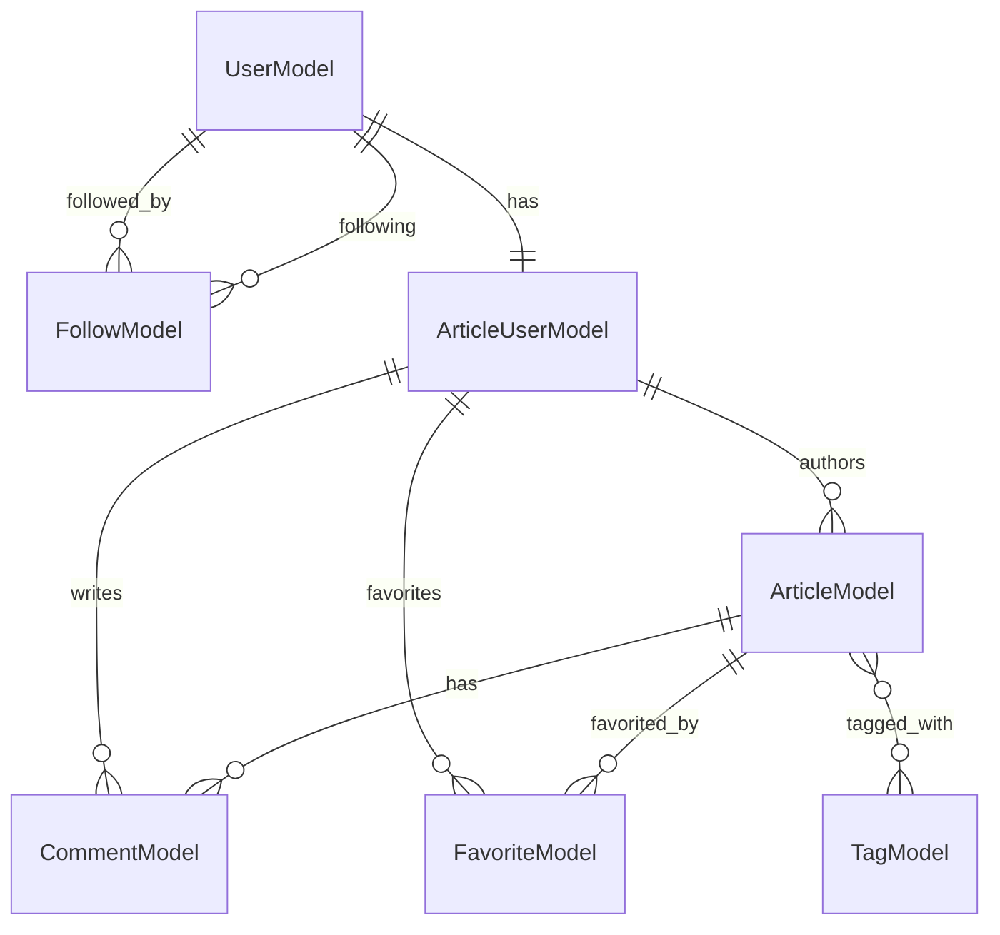

# Domain Model

## Sections

- [Entities](entities.md) - 7 entities across 2 aggregates
- [Value Objects](value-objects.md) - 5 response DTOs, 9 serializers, 3 helper functions, 1 error type
- [Enums](enums.md) - 3 constants (no explicit enums)
- [Validation](validation.md) - 4 validators with bind methods and factory functions

## Summary

| Metric | Count |
|--------|-------|
| Entities | 7 |
| Response DTOs | 5 |
| Serializers | 9 |
| Helper Functions | 3 |
| Validators | 4 |
| Constants | 3 |

## Entity Overview

### User Aggregate

| Entity | Table | Source |
|--------|-------|--------|
| UserModel | user_models | [users/models.go#L16-L23](https://github.com/gothinkster/golang-gin-realworld-example-app/blob/main/users/models.go#L16-L23) |
| FollowModel | follow_models | [users/models.go#L36-L42](https://github.com/gothinkster/golang-gin-realworld-example-app/blob/main/users/models.go#L36-L42) |

### Article Aggregate

| Entity | Table | Source |
|--------|-------|--------|
| ArticleModel | article_models | [articles/models.go#L11-L21](https://github.com/gothinkster/golang-gin-realworld-example-app/blob/main/articles/models.go#L11-L21) |
| ArticleUserModel | article_user_models | [articles/models.go#L23-L29](https://github.com/gothinkster/golang-gin-realworld-example-app/blob/main/articles/models.go#L23-L29) |
| FavoriteModel | favorite_models | [articles/models.go#L31-L37](https://github.com/gothinkster/golang-gin-realworld-example-app/blob/main/articles/models.go#L31-L37) |
| TagModel | tag_models | [articles/models.go#L39-L43](https://github.com/gothinkster/golang-gin-realworld-example-app/blob/main/articles/models.go#L39-L43) |
| CommentModel | comment_models | [articles/models.go#L45-L52](https://github.com/gothinkster/golang-gin-realworld-example-app/blob/main/articles/models.go#L45-L52) |

## Key Relationships

## Unique Constraints

| Entity | Field | Source |
|--------|-------|--------|
| UserModel | Email | [users/models.go#L19](https://github.com/gothinkster/golang-gin-realworld-example-app/blob/main/users/models.go#L19) |
| ArticleModel | Slug | [articles/models.go#L13](https://github.com/gothinkster/golang-gin-realworld-example-app/blob/main/articles/models.go#L13) |
| TagModel | Tag | [articles/models.go#L41](https://github.com/gothinkster/golang-gin-realworld-example-app/blob/main/articles/models.go#L41) |

## Source Files

| File | Purpose |
|------|---------|
| [users/models.go](https://github.com/gothinkster/golang-gin-realworld-example-app/blob/main/users/models.go) | User and Follow entities |
| [users/validators.go](https://github.com/gothinkster/golang-gin-realworld-example-app/blob/main/users/validators.go) | User validation rules |
| [users/serializers.go](https://github.com/gothinkster/golang-gin-realworld-example-app/blob/main/users/serializers.go) | User response DTOs |
| [articles/models.go](https://github.com/gothinkster/golang-gin-realworld-example-app/blob/main/articles/models.go) | Article, Comment, Tag, Favorite entities |
| [articles/validators.go](https://github.com/gothinkster/golang-gin-realworld-example-app/blob/main/articles/validators.go) | Article/Comment validation rules |
| [articles/serializers.go](https://github.com/gothinkster/golang-gin-realworld-example-app/blob/main/articles/serializers.go) | Article/Comment response DTOs |
| [common/utils.go](https://github.com/gothinkster/golang-gin-realworld-example-app/blob/main/common/utils.go) | Error types and binding helpers |
| [common/database.go](https://github.com/gothinkster/golang-gin-realworld-example-app/blob/main/common/database.go) | Database configuration |

## Unknowns

- No explicit self-reference prevention for FollowModel (user cannot follow themselves)
- ArticleUserModel serves as a bridge entity but creates indirection between UserModel and article domain
- No enum types defined for explicit state management
