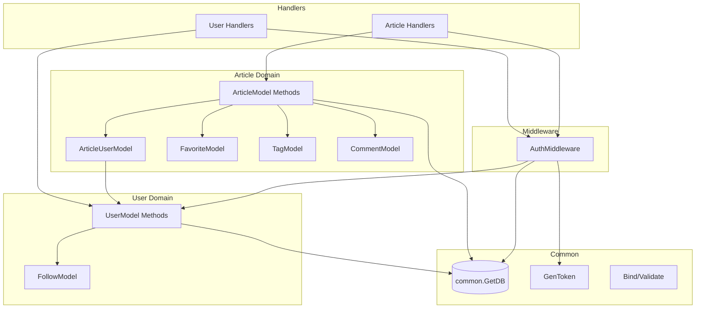

# Service Layer

## Architecture Pattern

**Active Record** - Service logic is embedded in domain model methods rather than separate service classes.

## Sections

- [Services](services.md) - Model methods and handler orchestration
- [DTOs](dtos.md) - Request validators and response structures
- [Mappers](mappers.md) - Serializers (Model -> Response DTO)
- [Formulas](formulas.md) - Business calculations and constants
- [External Clients](clients.md) - None (self-contained application)

## Summary

| Category | Count |
|----------|-------|
| Model Service Methods | 22 |
| Request DTOs (Validators) | 4 |
| Response DTOs | 5 |
| Serializers (Mappers) | 8 |
| Handler Functions | 19 |
| Route Registration Functions | 7 |
| External Clients | 0 |

## Service Method Inventory

### User Domain

| Method | Location | Purpose |
|--------|----------|---------|
| AutoMigrate | [users/models.go:45-50](https://github.com/gothinkster/golang-gin-realworld-example-app/blob/main/users/models.go#L45-L50) | Create UserModel and FollowModel tables |
| setPassword | [users/models.go:57-66](https://github.com/gothinkster/golang-gin-realworld-example-app/blob/main/users/models.go#L57-L66) | Hash password with bcrypt |
| checkPassword | [users/models.go:71-75](https://github.com/gothinkster/golang-gin-realworld-example-app/blob/main/users/models.go#L71-L75) | Verify password |
| FindOneUser | [users/models.go:80-85](https://github.com/gothinkster/golang-gin-realworld-example-app/blob/main/users/models.go#L80-L85) | Find user by condition |
| SaveOne | [users/models.go:90-94](https://github.com/gothinkster/golang-gin-realworld-example-app/blob/main/users/models.go#L90-L94) | Save user |
| Update | [users/models.go:99-103](https://github.com/gothinkster/golang-gin-realworld-example-app/blob/main/users/models.go#L99-L103) | Update user |
| following | [users/models.go:108-116](https://github.com/gothinkster/golang-gin-realworld-example-app/blob/main/users/models.go#L108-L116) | Create follow relationship |
| isFollowing | [users/models.go:121-129](https://github.com/gothinkster/golang-gin-realworld-example-app/blob/main/users/models.go#L121-L129) | Check follow status |
| unFollowing | [users/models.go:134-138](https://github.com/gothinkster/golang-gin-realworld-example-app/blob/main/users/models.go#L134-L138) | Remove follow |
| GetFollowings | [users/models.go:143-154](https://github.com/gothinkster/golang-gin-realworld-example-app/blob/main/users/models.go#L143-L154) | Get followed users |

### Article Domain

| Method | Location | Purpose |
|--------|----------|---------|
| GetArticleUserModel | [articles/models.go:54-65](https://github.com/gothinkster/golang-gin-realworld-example-app/blob/main/articles/models.go#L54-L65) | Get/create article author |
| favoritesCount | [articles/models.go:67-74](https://github.com/gothinkster/golang-gin-realworld-example-app/blob/main/articles/models.go#L67-L74) | Count article favorites |
| isFavoriteBy | [articles/models.go:76-84](https://github.com/gothinkster/golang-gin-realworld-example-app/blob/main/articles/models.go#L76-L84) | Check favorite status |
| BatchGetFavoriteCounts | [articles/models.go:87-109](https://github.com/gothinkster/golang-gin-realworld-example-app/blob/main/articles/models.go#L87-L109) | Batch count favorites |
| BatchGetFavoriteStatus | [articles/models.go:112-126](https://github.com/gothinkster/golang-gin-realworld-example-app/blob/main/articles/models.go#L112-L126) | Batch check favorites |
| favoriteBy | [articles/models.go:128-136](https://github.com/gothinkster/golang-gin-realworld-example-app/blob/main/articles/models.go#L128-L136) | Add favorite |
| unFavoriteBy | [articles/models.go:138-142](https://github.com/gothinkster/golang-gin-realworld-example-app/blob/main/articles/models.go#L138-L142) | Remove favorite |
| FindOneArticle | [articles/models.go:150-155](https://github.com/gothinkster/golang-gin-realworld-example-app/blob/main/articles/models.go#L150-L155) | Find article with preloads |
| FindManyArticle | [articles/models.go:177-264](https://github.com/gothinkster/golang-gin-realworld-example-app/blob/main/articles/models.go#L177-L264) | List articles with filters |
| GetArticleFeed | [articles/models.go:266-308](https://github.com/gothinkster/golang-gin-realworld-example-app/blob/main/articles/models.go#L266-L308) | Get feed from followed |
| FindOneComment | [articles/models.go:157-162](https://github.com/gothinkster/golang-gin-realworld-example-app/blob/main/articles/models.go#L157-L162) | Find comment with preloads |
| getComments | [articles/models.go:164-168](https://github.com/gothinkster/golang-gin-realworld-example-app/blob/main/articles/models.go#L164-L168) | Load comments for article |
| getAllTags | [articles/models.go:170-175](https://github.com/gothinkster/golang-gin-realworld-example-app/blob/main/articles/models.go#L170-L175) | Get all tags |
| setTags | [articles/models.go:310-350](https://github.com/gothinkster/golang-gin-realworld-example-app/blob/main/articles/models.go#L310-L350) | Set article tags |
| DeleteArticleModel | [articles/models.go:358-362](https://github.com/gothinkster/golang-gin-realworld-example-app/blob/main/articles/models.go#L358-L362) | Delete article |
| DeleteCommentModel | [articles/models.go:364-368](https://github.com/gothinkster/golang-gin-realworld-example-app/blob/main/articles/models.go#L364-L368) | Delete comment |

### Authentication

| Method | Location | Purpose |
|--------|----------|---------|
| GenToken | [common/utils.go:45-57](https://github.com/gothinkster/golang-gin-realworld-example-app/blob/main/common/utils.go#L45-L57) | Generate JWT |
| AuthMiddleware | [users/middlewares.go:43-75](https://github.com/gothinkster/golang-gin-realworld-example-app/blob/main/users/middlewares.go#L43-L75) | Authenticate requests |

## Service Dependencies

## Key Patterns

### N+1 Query Prevention

Batch operations implemented:
- `BatchGetFavoriteCounts` - Single query for multiple article favorites
- `BatchGetFavoriteStatus` - Single query for user's favorite status
- `ArticlesSerializer.Response` - Uses batch methods for list serialization

### Idempotent Operations

Uses `FirstOrCreate` pattern:
- `following` - Create follow if not exists
- `favoriteBy` - Create favorite if not exists
- `GetArticleUserModel` - Get or create article author mapping

### Transaction Usage

`FindManyArticle` and `GetArticleFeed` use transactions for consistent reads during complex filter operations.

### Authorization

Owner checks performed in handlers before update/delete:
- Article update/delete: `articleModel.AuthorID != articleUserModel.ID`
- Comment delete: `commentModel.AuthorID != articleUserModel.ID`

## Unknowns

- No explicit transaction boundaries for write operations (relies on GORM auto-commit)
- Password validation only checks length, no complexity requirements
- JWT secret is hardcoded, should be environment variable
- No rate limiting or request throttling
