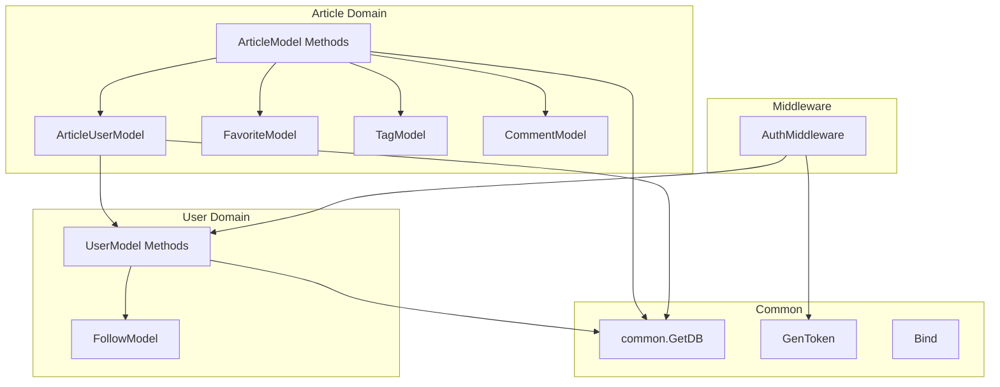

# Services

Active Record pattern - service logic embedded in model methods and handler functions.

## User Domain Services

### AutoMigrate [SHOULD]

[Source](https://github.com/gothinkster/golang-gin-realworld-example-app/blob/main/users/models.go#L45-L50)

```go
func AutoMigrate() {
	db := common.GetDB()

	db.AutoMigrate(&UserModel{})
	db.AutoMigrate(&FollowModel{})
}
```

- Database migration function for user domain
- Creates UserModel and FollowModel tables
- Called at application startup

### UserModel Methods

[users/models.go](https://github.com/gothinkster/golang-gin-realworld-example-app/blob/main/users/models.go)

#### setPassword [MUST]

[Source](https://github.com/gothinkster/golang-gin-realworld-example-app/blob/main/users/models.go#L57-L66)

```go
func (u *UserModel) setPassword(password string) error {
	if len(password) == 0 {
		return errors.New("password should not be empty!")
	}
	bytePassword := []byte(password)
	passwordHash, _ := bcrypt.GenerateFromPassword(bytePassword, bcrypt.DefaultCost)
	u.PasswordHash = string(passwordHash)
	return nil
}
```

- Validates password not empty
- Hashes with bcrypt.DefaultCost

#### checkPassword [MUST]

[Source](https://github.com/gothinkster/golang-gin-realworld-example-app/blob/main/users/models.go#L71-L75)

```go
func (u *UserModel) checkPassword(password string) error {
	bytePassword := []byte(password)
	byteHashedPassword := []byte(u.PasswordHash)
	return bcrypt.CompareHashAndPassword(byteHashedPassword, bytePassword)
}
```

- Compares plain password against stored hash

#### FindOneUser [MUST]

[Source](https://github.com/gothinkster/golang-gin-realworld-example-app/blob/main/users/models.go#L80-L85)

```go
func FindOneUser(condition interface{}) (UserModel, error) {
	db := common.GetDB()
	var model UserModel
	err := db.Where(condition).First(&model).Error
	return model, err
}
```

- Generic finder by any condition

#### SaveOne [MUST]

[Source](https://github.com/gothinkster/golang-gin-realworld-example-app/blob/main/users/models.go#L90-L94)

```go
func SaveOne(data interface{}) error {
	db := common.GetDB()
	err := db.Save(data).Error
	return err
}
```

- Generic save operation

#### Update [SHOULD]

[Source](https://github.com/gothinkster/golang-gin-realworld-example-app/blob/main/users/models.go#L99-L103)

```go
func (model *UserModel) Update(data interface{}) error {
	db := common.GetDB()
	err := db.Model(model).Updates(data).Error
	return err
}
```

- Updates user with provided data

#### following [SHOULD]

[Source](https://github.com/gothinkster/golang-gin-realworld-example-app/blob/main/users/models.go#L108-L116)

```go
func (u UserModel) following(v UserModel) error {
	db := common.GetDB()
	var follow FollowModel
	err := db.FirstOrCreate(&follow, &FollowModel{
		FollowingID:  v.ID,
		FollowedByID: u.ID,
	}).Error
	return err
}
```

- Creates follow relationship (idempotent via FirstOrCreate)

#### isFollowing [SHOULD]

[Source](https://github.com/gothinkster/golang-gin-realworld-example-app/blob/main/users/models.go#L121-L129)

```go
func (u UserModel) isFollowing(v UserModel) bool {
	db := common.GetDB()
	var follow FollowModel
	db.Where(FollowModel{
		FollowingID:  v.ID,
		FollowedByID: u.ID,
	}).First(&follow)
	return follow.ID != 0
}
```

- Checks if follow relationship exists

#### unFollowing [SHOULD]

[Source](https://github.com/gothinkster/golang-gin-realworld-example-app/blob/main/users/models.go#L134-L138)

```go
func (u UserModel) unFollowing(v UserModel) error {
	db := common.GetDB()
	err := db.Where("following_id = ? AND followed_by_id = ?", v.ID, u.ID).Delete(&FollowModel{}).Error
	return err
}
```

- Removes follow relationship

#### GetFollowings [SHOULD]

[Source](https://github.com/gothinkster/golang-gin-realworld-example-app/blob/main/users/models.go#L143-L154)

```go
func (u UserModel) GetFollowings() []UserModel {
	db := common.GetDB()
	var follows []FollowModel
	var followings []UserModel
	db.Preload("Following").Where(FollowModel{
		FollowedByID: u.ID,
	}).Find(&follows)
	for _, follow := range follows {
		followings = append(followings, follow.Following)
	}
	return followings
}
```

- Returns list of users being followed

## Article Domain Services

### ArticleModel Methods

[articles/models.go](https://github.com/gothinkster/golang-gin-realworld-example-app/blob/main/articles/models.go)

#### GetArticleUserModel [MUST]

[Source](https://github.com/gothinkster/golang-gin-realworld-example-app/blob/main/articles/models.go#L54-L65)

```go
func GetArticleUserModel(userModel users.UserModel) ArticleUserModel {
	var articleUserModel ArticleUserModel
	if userModel.ID == 0 {
		return articleUserModel
	}
	db := common.GetDB()
	db.Where(&ArticleUserModel{
		UserModelID: userModel.ID,
	}).FirstOrCreate(&articleUserModel)
	articleUserModel.UserModel = userModel
	return articleUserModel
}
```

- Maps UserModel to ArticleUserModel (author context)
- Creates if not exists (FirstOrCreate)

#### favoritesCount [SHOULD]

[Source](https://github.com/gothinkster/golang-gin-realworld-example-app/blob/main/articles/models.go#L67-L74)

```go
func (article ArticleModel) favoritesCount() uint {
	db := common.GetDB()
	var count int64
	db.Model(&FavoriteModel{}).Where(FavoriteModel{
		FavoriteID: article.ID,
	}).Count(&count)
	return uint(count)
}
```

- Counts favorites for an article

#### isFavoriteBy [SHOULD]

[Source](https://github.com/gothinkster/golang-gin-realworld-example-app/blob/main/articles/models.go#L76-L84)

```go
func (article ArticleModel) isFavoriteBy(user ArticleUserModel) bool {
	db := common.GetDB()
	var favorite FavoriteModel
	db.Where(FavoriteModel{
		FavoriteID:   article.ID,
		FavoriteByID: user.ID,
	}).First(&favorite)
	return favorite.ID != 0
}
```

- Checks if user favorited article

#### BatchGetFavoriteCounts [MUST]

[Source](https://github.com/gothinkster/golang-gin-realworld-example-app/blob/main/articles/models.go#L87-L109)

```go
func BatchGetFavoriteCounts(articleIDs []uint) map[uint]uint {
	if len(articleIDs) == 0 {
		return make(map[uint]uint)
	}
	db := common.GetDB()

	type result struct {
		FavoriteID uint
		Count      uint
	}
	var results []result
	db.Model(&FavoriteModel{}).
		Select("favorite_id, COUNT(*) as count").
		Where("favorite_id IN ?", articleIDs).
		Group("favorite_id").
		Find(&results)

	countMap := make(map[uint]uint)
	for _, r := range results {
		countMap[r.FavoriteID] = r.Count
	}
	return countMap
}
```

- Batch fetches favorite counts (N+1 optimization)

#### BatchGetFavoriteStatus [MUST]

[Source](https://github.com/gothinkster/golang-gin-realworld-example-app/blob/main/articles/models.go#L112-L126)

```go
func BatchGetFavoriteStatus(articleIDs []uint, userID uint) map[uint]bool {
	if len(articleIDs) == 0 || userID == 0 {
		return make(map[uint]bool)
	}
	db := common.GetDB()

	var favorites []FavoriteModel
	db.Where("favorite_id IN ? AND favorite_by_id = ?", articleIDs, userID).Find(&favorites)

	statusMap := make(map[uint]bool)
	for _, f := range favorites {
		statusMap[f.FavoriteID] = true
	}
	return statusMap
}
```

- Batch fetches favorite status (N+1 optimization)

#### favoriteBy [SHOULD]

[Source](https://github.com/gothinkster/golang-gin-realworld-example-app/blob/main/articles/models.go#L128-L136)

```go
func (article ArticleModel) favoriteBy(user ArticleUserModel) error {
	db := common.GetDB()
	var favorite FavoriteModel
	err := db.FirstOrCreate(&favorite, &FavoriteModel{
		FavoriteID:   article.ID,
		FavoriteByID: user.ID,
	}).Error
	return err
}
```

- Creates favorite (idempotent via FirstOrCreate)

#### unFavoriteBy [SHOULD]

[Source](https://github.com/gothinkster/golang-gin-realworld-example-app/blob/main/articles/models.go#L138-L142)

```go
func (article ArticleModel) unFavoriteBy(user ArticleUserModel) error {
	db := common.GetDB()
	err := db.Where("favorite_id = ? AND favorite_by_id = ?", article.ID, user.ID).Delete(&FavoriteModel{}).Error
	return err
}
```

- Removes favorite

#### SaveOne (articles)

[Source](https://github.com/gothinkster/golang-gin-realworld-example-app/blob/main/articles/models.go#L144-L148)

```go
func SaveOne(data interface{}) error {
	db := common.GetDB()
	err := db.Save(data).Error
	return err
}
```

- Generic save for articles package

#### FindOneArticle [MUST]

[Source](https://github.com/gothinkster/golang-gin-realworld-example-app/blob/main/articles/models.go#L150-L155)

```go
func FindOneArticle(condition interface{}) (ArticleModel, error) {
	db := common.GetDB()
	var model ArticleModel
	err := db.Preload("Author.UserModel").Preload("Tags").Where(condition).First(&model).Error
	return model, err
}
```

- Finds article with preloaded Author and Tags

#### FindOneComment [SHOULD]

[Source](https://github.com/gothinkster/golang-gin-realworld-example-app/blob/main/articles/models.go#L157-L162)

```go
func FindOneComment(condition *CommentModel) (CommentModel, error) {
	db := common.GetDB()
	var model CommentModel
	err := db.Preload("Author.UserModel").Preload("Article").Where(condition).First(&model).Error
	return model, err
}
```

- Finds comment with preloaded Author and Article

#### getComments [SHOULD]

[Source](https://github.com/gothinkster/golang-gin-realworld-example-app/blob/main/articles/models.go#L164-L168)

```go
func (self *ArticleModel) getComments() error {
	db := common.GetDB()
	err := db.Preload("Author.UserModel").Model(self).Association("Comments").Find(&self.Comments)
	return err
}
```

- Loads comments for article

#### getAllTags [SHOULD]

[Source](https://github.com/gothinkster/golang-gin-realworld-example-app/blob/main/articles/models.go#L170-L175)

```go
func getAllTags() ([]TagModel, error) {
	db := common.GetDB()
	var models []TagModel
	err := db.Find(&models).Error
	return models, err
}
```

- Returns all tags

#### FindManyArticle [MUST]

[Source](https://github.com/gothinkster/golang-gin-realworld-example-app/blob/main/articles/models.go#L177-L264)

```go
func FindManyArticle(tag, author, limit, offset, favorited string) ([]ArticleModel, int, error) {
	db := common.GetDB()
	var models []ArticleModel
	var count int

	offset_int, errOffset := strconv.Atoi(offset)
	if errOffset != nil {
		offset_int = 0
	}

	limit_int, errLimit := strconv.Atoi(limit)
	if errLimit != nil {
		limit_int = 20
	}

	tx := db.Begin()
	if tag != "" {
		// Filter by tag
		var tagModel TagModel
		tx.Where(TagModel{Tag: tag}).First(&tagModel)
		if tagModel.ID != 0 {
			var tempModels []ArticleModel
			if err := tx.Model(&tagModel).Offset(offset_int).Limit(limit_int).Association("ArticleModels").Find(&tempModels); err != nil {
				tx.Rollback()
				return models, count, err
			}
			count = int(tx.Model(&tagModel).Association("ArticleModels").Count())
			if len(tempModels) > 0 {
				var ids []uint
				for _, m := range tempModels {
					ids = append(ids, m.ID)
				}
				tx.Preload("Author.UserModel").Preload("Tags").Where("id IN ?", ids).Order("updated_at desc").Find(&models)
			}
		}
	} else if author != "" {
		// Filter by author
		var userModel users.UserModel
		tx.Where(users.UserModel{Username: author}).First(&userModel)
		articleUserModel := GetArticleUserModel(userModel)

		if articleUserModel.ID != 0 {
			count = int(tx.Model(&articleUserModel).Association("ArticleModels").Count())
			var tempModels []ArticleModel
			if err := tx.Model(&articleUserModel).Offset(offset_int).Limit(limit_int).Association("ArticleModels").Find(&tempModels); err != nil {
				tx.Rollback()
				return models, count, err
			}
			if len(tempModels) > 0 {
				var ids []uint
				for _, m := range tempModels {
					ids = append(ids, m.ID)
				}
				tx.Preload("Author.UserModel").Preload("Tags").Where("id IN ?", ids).Order("updated_at desc").Find(&models)
			}
		}
	} else if favorited != "" {
		// Filter by favorited user
		var userModel users.UserModel
		tx.Where(users.UserModel{Username: favorited}).First(&userModel)
		articleUserModel := GetArticleUserModel(userModel)
		if articleUserModel.ID != 0 {
			var favoriteModels []FavoriteModel
			tx.Where(FavoriteModel{
				FavoriteByID: articleUserModel.ID,
			}).Offset(offset_int).Limit(limit_int).Find(&favoriteModels)

			count = int(tx.Model(&articleUserModel).Association("FavoriteModels").Count())
			if len(favoriteModels) > 0 {
				var ids []uint
				for _, favorite := range favoriteModels {
					ids = append(ids, favorite.FavoriteID)
				}
				tx.Preload("Author.UserModel").Preload("Tags").Where("id IN ?", ids).Order("updated_at desc").Find(&models)
			}
		}
	} else {
		// No filter - all articles
		var count64 int64
		tx.Model(&ArticleModel{}).Count(&count64)
		count = int(count64)
		tx.Offset(offset_int).Limit(limit_int).Preload("Author.UserModel").Preload("Tags").Find(&models)
	}

	err := tx.Commit().Error
	return models, count, err
}
```

- Complex query with multiple filter paths
- Uses transaction for consistent reads
- Default limit: 20
- Default offset: 0

#### GetArticleFeed [MUST]

[Source](https://github.com/gothinkster/golang-gin-realworld-example-app/blob/main/articles/models.go#L266-L308)

```go
func (self *ArticleUserModel) GetArticleFeed(limit, offset string) ([]ArticleModel, int, error) {
	db := common.GetDB()
	models := make([]ArticleModel, 0)
	var count int

	offset_int, errOffset := strconv.Atoi(offset)
	if errOffset != nil {
		offset_int = 0
	}
	limit_int, errLimit := strconv.Atoi(limit)
	if errLimit != nil {
		limit_int = 20
	}

	tx := db.Begin()
	followings := self.UserModel.GetFollowings()

	if len(followings) > 0 {
		var followingUserIDs []uint
		for _, following := range followings {
			followingUserIDs = append(followingUserIDs, following.ID)
		}

		var articleUserModels []ArticleUserModel
		tx.Where("user_model_id IN ?", followingUserIDs).Find(&articleUserModels)

		var authorIDs []uint
		for _, aum := range articleUserModels {
			authorIDs = append(authorIDs, aum.ID)
		}

		if len(authorIDs) > 0 {
			var count64 int64
			tx.Model(&ArticleModel{}).Where("author_id IN ?", authorIDs).Count(&count64)
			count = int(count64)
			tx.Preload("Author.UserModel").Preload("Tags").Where("author_id IN ?", authorIDs).Order("updated_at desc").Offset(offset_int).Limit(limit_int).Find(&models)
		}
	}

	err := tx.Commit().Error
	return models, count, err
}
```

- Returns articles from followed users
- Batch fetches to avoid N+1
- Default limit: 20

#### setTags [SHOULD]

[Source](https://github.com/gothinkster/golang-gin-realworld-example-app/blob/main/articles/models.go#L310-L350)

```go
func (model *ArticleModel) setTags(tags []string) error {
	if len(tags) == 0 {
		model.Tags = []TagModel{}
		return nil
	}

	db := common.GetDB()

	var existingTags []TagModel
	db.Where("tag IN ?", tags).Find(&existingTags)

	existingTagMap := make(map[string]TagModel)
	for _, t := range existingTags {
		existingTagMap[t.Tag] = t
	}

	var tagList []TagModel
	for _, tag := range tags {
		if existing, ok := existingTagMap[tag]; ok {
			tagList = append(tagList, existing)
		} else {
			newTag := TagModel{Tag: tag}
			if err := db.Create(&newTag).Error; err != nil {
				var existing TagModel
				if err2 := db.Where("tag = ?", tag).First(&existing).Error; err2 == nil {
					tagList = append(tagList, existing)
					continue
				}
				return err
			}
			tagList = append(tagList, newTag)
		}
	}
	model.Tags = tagList
	return nil
}
```

- Batch fetches existing tags
- Creates missing tags with race condition handling

#### Update (ArticleModel)

[Source](https://github.com/gothinkster/golang-gin-realworld-example-app/blob/main/articles/models.go#L352-L356)

```go
func (model *ArticleModel) Update(data interface{}) error {
	db := common.GetDB()
	err := db.Model(model).Updates(data).Error
	return err
}
```

- Updates article with provided data

#### DeleteArticleModel [SHOULD]

[Source](https://github.com/gothinkster/golang-gin-realworld-example-app/blob/main/articles/models.go#L358-L362)

```go
func DeleteArticleModel(condition interface{}) error {
	db := common.GetDB()
	err := db.Where(condition).Delete(&ArticleModel{}).Error
	return err
}
```

- Deletes article by condition

#### DeleteCommentModel [SHOULD]

[Source](https://github.com/gothinkster/golang-gin-realworld-example-app/blob/main/articles/models.go#L364-L368)

```go
func DeleteCommentModel(condition interface{}) error {
	db := common.GetDB()
	err := db.Where(condition).Delete(&CommentModel{}).Error
	return err
}
```

- Deletes comment by condition
- Takes generic `interface{}` condition parameter (e.g., `[]uint{id}` for ID-based deletion)

## Authentication Services

### JWT Token Generation

[common/utils.go](https://github.com/gothinkster/golang-gin-realworld-example-app/blob/main/common/utils.go)

#### GenToken [MUST]

[Source](https://github.com/gothinkster/golang-gin-realworld-example-app/blob/main/common/utils.go#L45-L57)

```go
func GenToken(id uint) string {
	jwt_token := jwt.NewWithClaims(jwt.SigningMethodHS256, jwt.MapClaims{
		"id":  id,
		"exp": time.Now().Add(time.Hour * 24).Unix(),
	})
	token, err := jwt_token.SignedString([]byte(JWTSecret))
	if err != nil {
		fmt.Printf("failed to sign JWT token for id %d: %v\n", id, err)
		return ""
	}
	return token
}
```

- Creates JWT with user ID claim
- Expiration: 24 hours
- Signing: HS256

### AuthMiddleware

[users/middlewares.go](https://github.com/gothinkster/golang-gin-realworld-example-app/blob/main/users/middlewares.go)

#### extractToken [MUST]

[Source](https://github.com/gothinkster/golang-gin-realworld-example-app/blob/main/users/middlewares.go#L13-L27)

```go
func extractToken(c *gin.Context) string {
	bearerToken := c.GetHeader("Authorization")
	if len(bearerToken) > 6 && strings.ToUpper(bearerToken[0:6]) == "TOKEN " {
		return bearerToken[6:]
	}

	token := c.Query("access_token")
	if token != "" {
		return token
	}

	return ""
}
```

- Extracts from "Authorization: Token xxx" header
- Fallback: query parameter "access_token"

#### UpdateContextUserModel [SHOULD]

[Source](https://github.com/gothinkster/golang-gin-realworld-example-app/blob/main/users/middlewares.go#L30-L38)

```go
func UpdateContextUserModel(c *gin.Context, my_user_id uint) {
	var myUserModel UserModel
	if my_user_id != 0 {
		db := common.GetDB()
		db.First(&myUserModel, my_user_id)
	}
	c.Set("my_user_id", my_user_id)
	c.Set("my_user_model", myUserModel)
}
```

- Loads user from DB and sets in context

#### AuthMiddleware [MUST]

[Source](https://github.com/gothinkster/golang-gin-realworld-example-app/blob/main/users/middlewares.go#L43-L75)

```go
func AuthMiddleware(auto401 bool) gin.HandlerFunc {
	return func(c *gin.Context) {
		UpdateContextUserModel(c, 0)
		tokenString := extractToken(c)

		if tokenString == "" {
			if auto401 {
				c.AbortWithStatus(http.StatusUnauthorized)
			}
			return
		}

		token, err := jwt.Parse(tokenString, func(token *jwt.Token) (interface{}, error) {
			if _, ok := token.Method.(*jwt.SigningMethodHMAC); !ok {
				return nil, jwt.ErrSignatureInvalid
			}
			return []byte(common.JWTSecret), nil
		})

		if err != nil {
			if auto401 {
				c.AbortWithStatus(http.StatusUnauthorized)
			}
			return
		}

		if claims, ok := token.Claims.(jwt.MapClaims); ok && token.Valid {
			my_user_id := uint(claims["id"].(float64))
			UpdateContextUserModel(c, my_user_id)
		}
	}
}
```

- Parses JWT token
- Validates HMAC signing method
- Sets user in context
- auto401: controls whether to abort on auth failure

## Route Registration Functions [SHOULD]

Route registration functions wire up HTTP endpoints to handler functions.

### User Route Registration

[users/routers.go](https://github.com/gothinkster/golang-gin-realworld-example-app/blob/main/users/routers.go)

#### UsersRegister

[Source](https://github.com/gothinkster/golang-gin-realworld-example-app/blob/main/users/routers.go#L10-L14)

```go
func UsersRegister(router *gin.RouterGroup) {
	router.POST("", UsersRegistration)
	router.POST("/", UsersRegistration)
	router.POST("/login", UsersLogin)
}
```

- Registers public user routes (registration, login)

#### UserRegister

[Source](https://github.com/gothinkster/golang-gin-realworld-example-app/blob/main/users/routers.go#L16-L21)

```go
func UserRegister(router *gin.RouterGroup) {
	router.GET("", UserRetrieve)
	router.GET("/", UserRetrieve)
	router.PUT("", UserUpdate)
	router.PUT("/", UserUpdate)
}
```

- Registers authenticated user routes (retrieve, update)

#### ProfileRetrieveRegister

[Source](https://github.com/gothinkster/golang-gin-realworld-example-app/blob/main/users/routers.go#L23-L25)

```go
func ProfileRetrieveRegister(router *gin.RouterGroup) {
	router.GET("/:username", ProfileRetrieve)
}
```

- Registers public profile retrieval route

#### ProfileRegister

[Source](https://github.com/gothinkster/golang-gin-realworld-example-app/blob/main/users/routers.go#L27-L30)

```go
func ProfileRegister(router *gin.RouterGroup) {
	router.POST("/:username/follow", ProfileFollow)
	router.DELETE("/:username/follow", ProfileUnfollow)
}
```

- Registers authenticated profile routes (follow, unfollow)

### Article Route Registration

[articles/routers.go](https://github.com/gothinkster/golang-gin-realworld-example-app/blob/main/articles/routers.go)

#### ArticlesRegister

[Source](https://github.com/gothinkster/golang-gin-realworld-example-app/blob/main/articles/routers.go#L13-L24)

```go
func ArticlesRegister(router *gin.RouterGroup) {
	router.GET("/feed", ArticleFeed)
	router.POST("", ArticleCreate)
	router.POST("/", ArticleCreate)
	router.PUT("/:slug", ArticleUpdate)
	router.PUT("/:slug/", ArticleUpdate)
	router.DELETE("/:slug", ArticleDelete)
	router.POST("/:slug/favorite", ArticleFavorite)
	router.DELETE("/:slug/favorite", ArticleUnfavorite)
	router.POST("/:slug/comments", ArticleCommentCreate)
	router.DELETE("/:slug/comments/:id", ArticleCommentDelete)
}
```

- Registers authenticated article routes

#### ArticlesAnonymousRegister

[Source](https://github.com/gothinkster/golang-gin-realworld-example-app/blob/main/articles/routers.go#L26-L31)

```go
func ArticlesAnonymousRegister(router *gin.RouterGroup) {
	router.GET("", ArticleList)
	router.GET("/", ArticleList)
	router.GET("/:slug", ArticleRetrieve)
	router.GET("/:slug/comments", ArticleCommentList)
}
```

- Registers anonymous article routes (list, retrieve, comments)

#### TagsAnonymousRegister

[Source](https://github.com/gothinkster/golang-gin-realworld-example-app/blob/main/articles/routers.go#L33-L36)

```go
func TagsAnonymousRegister(router *gin.RouterGroup) {
	router.GET("", TagList)
	router.GET("/", TagList)
}
```

- Registers tag list route

## Handler Functions (Orchestration)

### User Handlers

[users/routers.go](https://github.com/gothinkster/golang-gin-realworld-example-app/blob/main/users/routers.go)

| Handler | Source | Operations |
|---------|--------|------------|
| UsersRegistration | [L78-L92](https://github.com/gothinkster/golang-gin-realworld-example-app/blob/main/users/routers.go#L78-L92) | Validate -> SaveOne -> Serialize |
| UsersLogin | [L94-L114](https://github.com/gothinkster/golang-gin-realworld-example-app/blob/main/users/routers.go#L94-L114) | Validate -> FindOneUser -> checkPassword -> UpdateContext -> Serialize |
| UserRetrieve | [L116-L119](https://github.com/gothinkster/golang-gin-realworld-example-app/blob/main/users/routers.go#L116-L119) | Serialize from context |
| UserUpdate | [L121-L137](https://github.com/gothinkster/golang-gin-realworld-example-app/blob/main/users/routers.go#L121-L137) | Validate -> Update -> UpdateContext -> Serialize |
| ProfileRetrieve | [L32-L41](https://github.com/gothinkster/golang-gin-realworld-example-app/blob/main/users/routers.go#L32-L41) | FindOneUser -> Serialize |
| ProfileFollow | [L43-L58](https://github.com/gothinkster/golang-gin-realworld-example-app/blob/main/users/routers.go#L43-L58) | FindOneUser -> following -> Serialize |
| ProfileUnfollow | [L60-L76](https://github.com/gothinkster/golang-gin-realworld-example-app/blob/main/users/routers.go#L60-L76) | FindOneUser -> unFollowing -> Serialize |

### Article Handlers

[articles/routers.go](https://github.com/gothinkster/golang-gin-realworld-example-app/blob/main/articles/routers.go)

| Handler | Source | Operations |
|---------|--------|------------|
| ArticleCreate | [L38-L52](https://github.com/gothinkster/golang-gin-realworld-example-app/blob/main/articles/routers.go#L38-L52) | Validate -> SaveOne -> Serialize |
| ArticleList | [L54-L68](https://github.com/gothinkster/golang-gin-realworld-example-app/blob/main/articles/routers.go#L54-L68) | FindManyArticle -> Serialize |
| ArticleFeed | [L70-L86](https://github.com/gothinkster/golang-gin-realworld-example-app/blob/main/articles/routers.go#L70-L86) | GetArticleFeed -> Serialize |
| ArticleRetrieve | [L88-L97](https://github.com/gothinkster/golang-gin-realworld-example-app/blob/main/articles/routers.go#L88-L97) | FindOneArticle -> Serialize |
| ArticleUpdate | [L99-L127](https://github.com/gothinkster/golang-gin-realworld-example-app/blob/main/articles/routers.go#L99-L127) | FindOneArticle -> AuthCheck -> Validate -> Update -> Serialize |
| ArticleDelete | [L129-L147](https://github.com/gothinkster/golang-gin-realworld-example-app/blob/main/articles/routers.go#L129-L147) | FindOneArticle -> AuthCheck -> DeleteArticleModel |
| ArticleFavorite | [L149-L163](https://github.com/gothinkster/golang-gin-realworld-example-app/blob/main/articles/routers.go#L149-L163) | FindOneArticle -> favoriteBy -> Serialize |
| ArticleUnfavorite | [L165-L179](https://github.com/gothinkster/golang-gin-realworld-example-app/blob/main/articles/routers.go#L165-L179) | FindOneArticle -> unFavoriteBy -> Serialize |
| ArticleCommentCreate | [L181-L201](https://github.com/gothinkster/golang-gin-realworld-example-app/blob/main/articles/routers.go#L181-L201) | FindOneArticle -> Validate -> SaveOne -> Serialize |
| ArticleCommentDelete | [L203-L226](https://github.com/gothinkster/golang-gin-realworld-example-app/blob/main/articles/routers.go#L203-L226) | FindOneComment -> AuthCheck -> DeleteCommentModel |
| ArticleCommentList | [L228-L242](https://github.com/gothinkster/golang-gin-realworld-example-app/blob/main/articles/routers.go#L228-L242) | FindOneArticle -> getComments -> Serialize |
| TagList | [L243-L251](https://github.com/gothinkster/golang-gin-realworld-example-app/blob/main/articles/routers.go#L243-L251) | getAllTags -> Serialize |

## Service Dependencies


